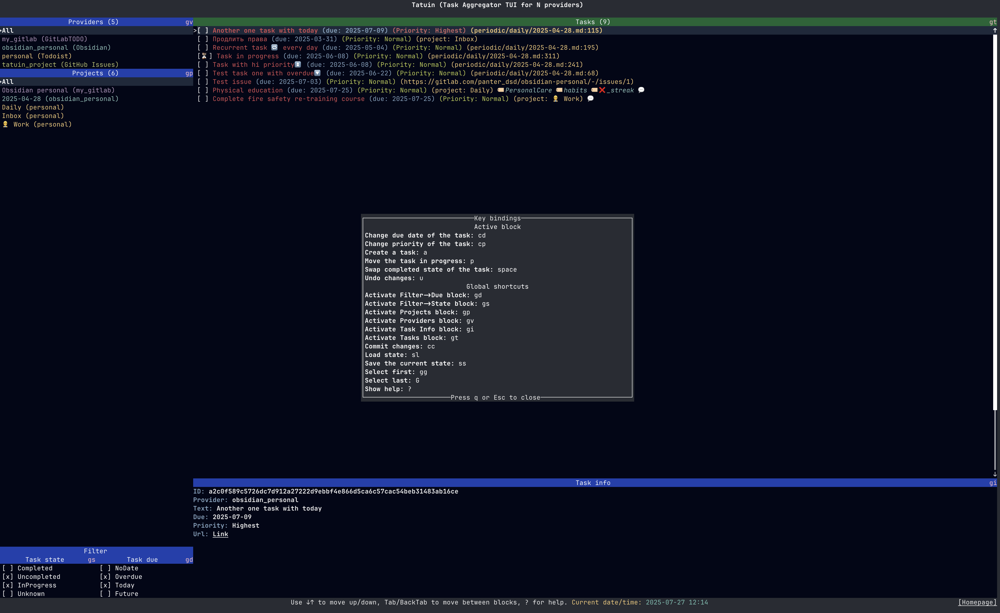

# Tatuin (Task Aggregator TUI for N providers)

Tatuin is a task aggregation tool that allows you to manage and track your tasks
from various providers in one convenient place.
Currently, the project supports the next providers:

- **Obsidian**
- **Todoist**
- **GitLab TODO**

Tatuin provides users with an easy-to-use Text User Interface (TUI) for viewing and managing their tasks.

## Features

- **Cross-provider Task Management:** Tatuin allows you to view and manage tasks across different task management platforms.
- **Command-line Interface (CLI):** The project is designed using a text-based interface, making it accessible from the command line.
- **Task Filters & Status Changes:** Easily filter and update your tasks' statuses as needed.

## Quick Start

### Installation

1. Install via cargo

   ```bash
   cargo install tatuin
   ~/.cargo/bin/tatuin --help
   ```

2. Install via homebrew

   ```bash
   brew install panter-dsd/tap/tatuin
   ```

### Adding New Providers

To add a new provider, use the following command:

```bash
tatuin add-provider
```

This command will guide you through setting up the integration for the specified provider.

## Screenshots



## Contributing

Pull requests are welcome. For major changes, please open an issue first to discuss what you would like to change.

Please make sure to update tests as appropriate.

## License

Distributed under the MIT License. See `LICENSE.txt` for more information.

---

Tatuin is a growing project with plans to add many more providers in future releases. Stay tuned and join us on this journey of improving task management!

For any questions or feedback, please feel free to open an issue on GitHub!
